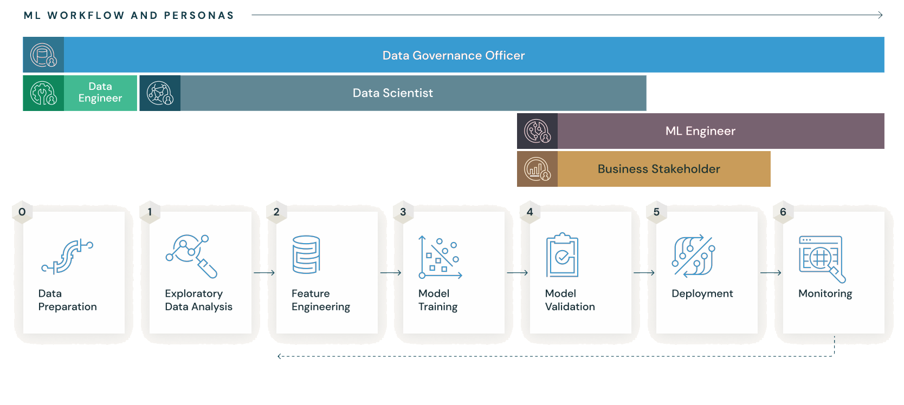

# **MLflow**  

MLflow is an open-source platform designed to manage the **machine learning (ML) lifecycle**, including **experimentation, reproducibility, and deployment**. It provides tools to track experiments, package models, and deploy them in various environments.  

---

## **🔹 Key Components of MLflow**  
1️⃣ **MLflow Tracking** – Logs and tracks ML experiments, including parameters, metrics, and artifacts.  
2️⃣ **MLflow Projects** – Defines reusable and reproducible ML code workflows.  
3️⃣ **MLflow Models** – Standard format to package ML models for deployment.  
4️⃣ **MLflow Registry** – Centralized model store for versioning and lifecycle management.  

---

## **🛠️ Installation**  
Run the following command to install MLflow:  

```bash
pip install mlflow
```

---

## **🚀 Basic Example**  
Here’s a simple example to log parameters and metrics using MLflow:  

```python
import mlflow

mlflow.start_run()
mlflow.log_param("alpha", 0.5)
mlflow.log_metric("accuracy", 0.85)
mlflow.end_run()
```

---

## **📢 Viewing the MLflow UI**  
To access the MLflow UI and track experiments, follow these steps:  

### **1️⃣ Start the MLflow Tracking Server**  
Navigate to your working directory and run:  

```bash
mlflow ui
```

By default, this starts the UI at:  
📍 **http://127.0.0.1:5000**  

---

### **2️⃣ Use a Different Port (If Needed)**  
If port `5000` is already in use, start MLflow on another port:  

```bash
mlflow ui --port 8080
```

Now, access the UI at:  
📍 **http://127.0.0.1:8080**  

---

### **3️⃣ Running MLflow on a Remote Server**  
If you're using a remote server, allow external access with:  

```bash
mlflow ui --host 0.0.0.0
```

Then, access it via:  
📍 `http://<server-ip>:5000`  

---

## **✅ Why Learn MLflow?**  

1️⃣ **Standardized Experiment Tracking** 📊  
   - Helps log and compare different model runs, hyperparameters, and performance metrics.  
   - Essential for **reproducibility** in ML projects.  

2️⃣ **Seamless Model Packaging & Deployment** 🚀  
   - Provides a standard way to package models across frameworks like **TensorFlow, PyTorch, Scikit-learn, and XGBoost**.  
   - Supports **multiple deployment options**, including cloud services like AWS, Azure, and GCP.  

3️⃣ **Model Versioning & Registry** 🔄  
   - Keeps track of different versions of trained models.  
   - Enables smooth collaboration in **team environments**.  

4️⃣ **Integration with Popular Tools** 🔌  
   - Works well with **Kubeflow, Airflow, Spark, and Kubernetes**.  
   - Supports cloud-based storage like **AWS S3, Azure Blob, and Google Cloud Storage**.  

5️⃣ **Industry Adoption & Career Growth** 📈  
   - Used by top companies for **MLOps & production ML pipelines**.  
   - Learning MLflow can enhance your career in **ML Engineering, Data Science, and MLOps**.  





Data Version Control (DVC) is an open-source tool designed to manage and version large datasets and machine learning models in data science projects. It works alongside Git to provide version control capabilities for data and models, complementing traditional code versioning[1][3].

## Key Features

1. **Data and Model Versioning**: DVC tracks changes in large files and datasets without storing them directly in Git repositories[1][3].

2. **Pipeline Management**: It allows defining and executing data processing and model training pipelines, ensuring reproducibility[2].

3. **Experiment Tracking**: DVC enables tracking and comparing different experiments, including parameters, metrics, and performance plots[2].

4. **Git Integration**: While handling large files separately, DVC integrates seamlessly with Git for code versioning[3].

5. **Remote Storage Support**: DVC supports various storage backends, including local file systems, network file systems, and cloud storage providers[4].

## How DVC Works

DVC replaces large files and directories with small metafiles in the Git repository. These metafiles contain MD5 hashes that point to the actual data stored separately[3]. When changes are made to data or models:

1. DVC detects modifications using `dvc status`[1].
2. Users stage updates with `dvc add`[1].
3. Changes are committed using `dvc commit`[1].
4. Generated `.dvc` files are added and committed to Git[1].

This approach allows data scientists to use standard Git workflows while efficiently managing large datasets[3][4].

## Benefits

- **Lightweight**: DVC is a free, open-source command-line tool that doesn't require databases or special services[4].
- **Consistency**: Maintains stable file names, eliminating the need for complicated versioning in file paths[4].
- **Efficient Data Management**: Optimizes storing and transferring large files[4].
- **Collaboration**: Facilitates project development and data sharing[4].
- **Data Compliance**: Enables review of data modifications through Git pull requests[4].
- **GitOps**: Connects data science projects with the Git ecosystem, opening doors to advanced CI/CD tools and specialized patterns[4].

DVC addresses the challenge of managing different lifecycles of data, models, and code in iterative data science and machine learning processes, providing a comprehensive solution for version control in data-driven projects[4].

Citations:
[1] https://www.dasca.org/world-of-data-science/article/effortless-data-and-model-versioning-with-dvc
[2] https://en.wikipedia.org/wiki/Data_Version_Control_(software)
[3] https://www.datacamp.com/tutorial/data-version-control-dvc
[4] https://dvc.org/doc/use-cases/versioning-data-and-models
[5] https://dvc.org
[6] https://www.linkedin.com/pulse/data-version-control-elevate-your-science-workflow-dvc-aishit-dharwal-3ixac
[7] https://github.com/iterative/dvc
[8] https://www.datacamp.com/courses/introduction-to-data-versioning-with-dvc


